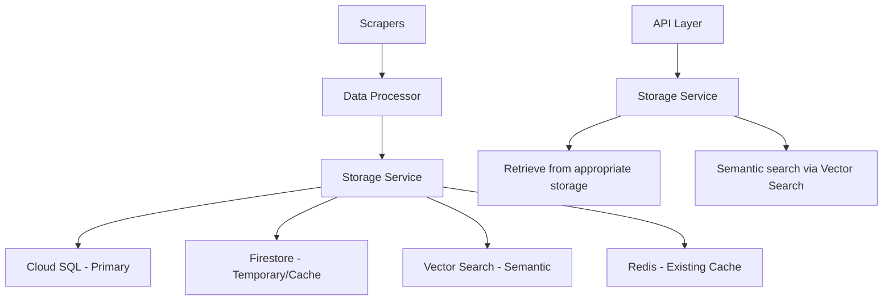

# Firestore and Vertex AI Vector Search Integration
===============================================

This document provides comprehensive documentation for the Firestore and Vertex AI Vector Search integration implemented for the MedellínBot web scraping project.

## Overview

The integration adds three new storage layers to the existing Cloud SQL and Redis infrastructure:

1. **Firestore**: For temporary data, cache, and user session data
2. **Vertex AI Vector Search**: For semantic search capabilities
3. **Unified Storage Service**: Manages data flow between all storage layers

## Architecture

### Storage Layer Hierarchy



### Data Flow

1. **Scraping**: Data is collected by domain-specific scrapers
2. **Processing**: Data is cleaned, validated, and processed
3. **Storage Decision**: Based on data type and configuration:
   - **Trámites, PQRSD**: Primary storage in Cloud SQL
   - **Pico y Placa, Notificaciones**: Primary storage in Firestore (temporary)
   - **Programas Sociales**: Storage in both Cloud SQL and Firestore
   - **Vector Search**: Enabled for content with semantic value
4. **Caching**: Processed data cached in Firestore for quick access
5. **Vectorization**: Text content converted to embeddings for semantic search

## Configuration

### Environment Variables

```bash
# Firestore Configuration
FIRESTORE_PROJECT_ID=your-gcp-project-id
FIRESTORE_DATABASE_ID=(default)
FIRESTORE_COLLECTION_PREFIX=medellinbot
FIRESTORE_EMULATOR_HOST=localhost:8080  # For development
USE_FIRESTORE_EMULATOR=false

# Vector Search Configuration
VECTOR_SEARCH_PROJECT_ID=your-gcp-project-id
VECTOR_SEARCH_REGION=us-central1
VECTOR_SEARCH_INDEX_ID=your-index-id
VECTOR_SEARCH_ENDPOINT_ID=your-endpoint-id
VECTOR_SEARCH_DIMENSIONS=768
VECTOR_SEARCH_METRIC=cosine

# Google Cloud Credentials
GOOGLE_APPLICATION_CREDENTIALS=/path/to/service-account.json
```

### Storage Configurations

Each data type has specific storage configuration:

```python
storage_configs = {
    "tramites": StorageConfig(
        primary_storage="cloud_sql",      # Primary storage location
        cache_enabled=True,              # Enable Firestore caching
        vector_search_enabled=True,      # Enable semantic search
        criticality=8                    # Priority level (1-10)
    ),
    "pico_placa": StorageConfig(
        primary_storage="firestore",     # Temporary data
        cache_enabled=True,
        vector_search_enabled=False,     # Not needed for temporary data
        ttl_days=1,                      # Auto-delete after 1 day
        criticality=10                   # High priority
    ),
    "programas_sociales": StorageConfig(
        primary_storage="both",          # Store in both Cloud SQL and Firestore
        cache_enabled=True,
        vector_search_enabled=True,      # Enable semantic search
        criticality=7
    )
}
```

## Implementation Details

### 1. Firestore Integration

**Files**:
- `web_scraping/config/firestore_config.py`
- `web_scraping/config/firestore_config.py`

**Key Features**:
- **Temporary Data Storage**: Auto-expiring documents with TTL
- **Caching Layer**: High-performance cache with configurable TTL
- **User Sessions**: Session management with automatic cleanup
- **Collection Management**: Prefix-based collection organization

**Usage**:
```python
from web_scraping.config.firestore_config import get_firestore_manager

firestore_manager = get_firestore_manager()

# Save temporary data
await firestore_manager.save_temporary_data(
    data_type="pico_placa",
    data={"restriction": "A-A", "date": "2024-01-01"},
    ttl_days=1
)

# Cache processed data
await firestore_manager.save_cache_entry(
    cache_key="tramites_processed",
    data=processed_data,
    ttl_days=1
)
```

### 2. Vector Search Integration

**Files**:
- `web_scraping/config/vector_search_config.py`
- `web_scraping/config/vector_search_config.py`

**Key Features**:
- **Embedding Generation**: Text to vector conversion using Vertex AI
- **Vector Index Management**: Create, deploy, and manage vector indices
- **Semantic Search**: Find similar content based on meaning
- **Automatic Deployment**: Index creation and endpoint deployment

**Usage**:
```python
from web_scraping.config.vector_search_config import get_vector_search_manager

vector_manager = get_vector_search_manager()

# Generate embeddings
embeddings = await vector_manager.generate_embeddings([
    "Trámite para renovación de licencia",
    "Proceso de solicitud de documentos"
])

# Store embeddings
await vector_manager.upsert_embeddings(
    ids=["doc1", "doc2"],
    embeddings=embeddings,
    metadata=[{"type": "tramite"}, {"type": "proceso"}]
)

# Search similar content
results = await vector_manager.search_similar_vectors(
    query_embedding=query_embedding,
    num_neighbors=5
)
```

### 3. Unified Storage Service

**Files**:
- `web_scraping/services/storage_service.py`

**Key Features**:
- **Multi-Backend Storage**: Automatic routing to appropriate storage
- **Data Synchronization**: Keep multiple storage layers in sync
- **Intelligent Caching**: Automatic cache management
- **Vector Integration**: Seamless embedding generation and storage

**Usage**:
```python
from web_scraping.services.storage_service import StorageService

storage_service = StorageService()

# Store data with automatic routing
result = await storage_service.store_data(
    source="alcaldia_medellin",
    data_type="tramites",
    raw_data=scraped_data
)

# Semantic search across all content
similar_content = await storage_service.search_similar_content(
    query="Cómo renovar mi licencia de conducción?",
    data_types=["tramites", "programas"]
)
```

### 4. Enhanced Data Processing

**Files**:
- `web_scraping/services/data_processor.py`

**Key Features**:
- **Vector Embedding Generation**: Automatic text extraction for embeddings
- **Multi-Storage Support**: Process data for multiple storage backends
- **Quality Scoring**: Enhanced quality assessment with vector data

**Usage**:
```python
from web_scraping.services.data_processor import DataProcessor

processor = DataProcessor()

# Process data with vector search integration
result = await processor.process_scraped_data(
    source="alcaldia_medellin",
    data_type="tramites",
    raw_data=scraped_data
)
```

## Data Types and Storage Strategy

### High-Criticality Data (Pico y Placa, Alertas)
- **Primary Storage**: Firestore (temporary)
- **TTL**: 1-7 days
- **Vector Search**: Disabled (temporary nature)
- **Cache**: Enabled for frequent queries

### Medium-Criticality Data (Trámites, PQRSD, Programas)
- **Primary Storage**: Cloud SQL (permanent)
- **TTL**: None (permanent storage)
- **Vector Search**: Enabled for semantic search
- **Cache**: Enabled for performance

### Low-Criticality Data (Entidades, Datos Abiertos)
- **Primary Storage**: Cloud SQL or Firestore based on update frequency
- **TTL**: 30+ days for temporary data
- **Vector Search**: Enabled for content-rich data
- **Cache**: Conditional based on access patterns

## API Integration

### New Endpoints

```python
# Semantic search endpoint
@app.route('/api/v1/search/semantic')
async def semantic_search():
    query = request.args.get('q', '')
    data_types = request.args.getlist('types')
    
    results = await storage_service.search_similar_content(
        query=query,
        data_types=data_types
    )
    return jsonify(results)

# Cache management endpoint
@app.route('/api/v1/cache/<cache_key>')
async def get_cached_data(cache_key):
    data = await firestore_manager.get_cache_entry(cache_key)
    return jsonify(data)
```

### Enhanced Existing Endpoints

```python
# Data retrieval with intelligent routing
@app.route('/api/v1/data/<data_type>')
async def get_data(data_type):
    # Try cache first, then primary storage
    data = await storage_service.retrieve_data(
        source="alcaldia_medellin",
        data_type=data_type,
        use_cache=True
    )
    return jsonify(data)
```

## Monitoring and Alerting

### Key Metrics

1. **Firestore Metrics**:
   - **Document Operations**: `firestore_writes_total`, `firestore_reads_total`
   - **Performance**: `firestore_write_duration_seconds`, `firestore_read_duration_seconds`
   - **Storage Usage**: `firestore_document_count`, `firestore_storage_bytes`
   - **Error Rates**: `firestore_errors_total`
   - **TTL Cleanup**: Automatic document expiration tracking
   - **Cache Performance**: `firestore_cache_hit_ratio`

2. **Vector Search Metrics**:
   - **Embedding Generation**: `vector_search_embeddings_total`, `vector_search_embedding_duration_seconds`
   - **Vector Operations**: `vector_search_upserts_total`, `vector_search_queries_total`
   - **Performance**: `vector_search_upsert_duration_seconds`, `vector_search_search_duration_seconds`
   - **Index Health**: `vector_search_index_size`, `vector_search_index_dimensions`
   - **Error Rates**: `vector_search_errors_total`

3. **Storage Service Metrics**:
   - **Cross-Storage Synchronization**: Data consistency across layers
   - **Storage Layer Health**: Availability and performance of each storage backend
   - **Data Quality**: `web_scraping_data_quality` by source and data type
   - **Request Metrics**: `web_scraping_requests_total`, `web_scraping_request_duration_seconds`

### Integrated Monitoring

The monitoring system is now fully integrated with the storage service, providing real-time metrics and alerting:

```python
# Automatic monitoring integration in StorageService
class StorageService:
    def __init__(self):
        self.monitoring_service = get_monitoring_service()
        # ... other initialization

    async def _store_in_firestore(self, source, data_type, data, config):
        start_time = time.time()
        # ... storage logic
        duration = time.time() - start_time
        self.monitoring_service.record_firestore_write(collection_name, "document_set", duration)
        # Update document count and storage metrics
        self.monitoring_service.update_firestore_document_count(collection_name, doc_count)
```

### Alert Configuration

```yaml
# Enhanced Cloud Monitoring alerts with Prometheus integration
alerts:
  - name: "firestore_write_latency"
    condition: "metric.type = 'firestore_write_duration_seconds' AND metric.value > 5"
    duration: "120s"
    severity: "warning"
    notification_channels: ["email:devops@medellin.gov.co"]
  
  - name: "vector_search_embedding_failures"
    condition: "rate(metric.type = 'vector_search_errors_total' where operation = 'embedding_generation') > 0.1"
    duration: "60s"
    severity: "critical"
    notification_channels: ["email:devops@medellin.gov.co", "slack:alerts"]
  
  - name: "storage_service_sync_failures"
    condition: "metric.type = 'storage_sync_failures' AND metric.value > 0"
    duration: "30s"
    severity: "critical"
    notification_channels: ["email:devops@medellin.gov.co", "pagerduty:critical"]
  
  - name: "data_quality_degradation"
    condition: "metric.type = 'web_scraping_data_quality' AND metric.value < 0.7"
    duration: "300s"
    severity: "warning"
    notification_channels: ["email:devops@medellin.gov.co"]
```

### Monitoring Dashboard

The monitoring system provides comprehensive dashboards with:

- **Real-time Storage Metrics**: Live view of all storage operations
- **Performance Trends**: Historical performance analysis
- **Error Tracking**: Real-time error rate monitoring
- **Capacity Planning**: Storage usage and growth trends
- **Service Health**: Overall system health status

```python
# Get system health status
health_status = monitoring_service.get_system_health()
print(f"System Status: {health_status['status']}")
print(f"Active Alerts: {health_status['active_alerts']}")
print(f"Uptime: {health_status['uptime_seconds']}s")

# Get metrics summary
metrics_summary = monitoring_service.get_metrics_summary()
print(f"Total Requests: {metrics_summary['total_requests']}")
print(f"Error Rate: {metrics_summary['error_rate']:.2%}")
print(f"Average Response Time: {metrics_summary['average_response_time']:.2f}s")
```

## Testing

### Test Coverage

1. **Unit Tests**: Individual component testing
2. **Integration Tests**: Cross-storage functionality
3. **Performance Tests**: Latency and throughput validation
4. **Consistency Tests**: Data synchronization verification

**Run Tests**:
```bash
# Run storage integration tests
pytest web_scraping/tests/test_storage_integration.py -v

# Run specific component tests
pytest web_scraping/tests/test_firestore_config.py -v
pytest web_scraping/tests/test_vector_search_config.py -v
```

### Comprehensive Testing Framework

In addition to the basic test coverage, a comprehensive testing framework validates the complete integration:

#### Comprehensive Storage Validation

The comprehensive test suite validates end-to-end functionality across all storage layers:

```python
# Run comprehensive storage validation
pytest web_scraping/tests/comprehensive_storage_validation.py -v

# Key test categories:
- test_end_to_end_storage_flow_cloud_sql: Complete Cloud SQL storage validation
- test_end_to_end_storage_flow_firestore: Complete Firestore storage validation
- test_end_to_end_storage_flow_vector_search: Complete Vector Search validation
- test_data_quality_validation: Data quality scoring and reporting
- test_error_handling_cloud_sql_failure: Cloud SQL failure scenarios
- test_error_handling_firestore_failure: Firestore failure scenarios
- test_error_handling_vector_search_failure: Vector Search failure scenarios
- test_semantic_search_functionality: End-to-end semantic search validation
- test_cache_functionality: Caching layer validation
- test_monitoring_integration: Complete monitoring integration validation
```

#### Test Data and Scenarios

The comprehensive tests use realistic data and scenarios:

```python
# Sample test data structure
sample_scraped_data = [
    {
        "type": "news",
        "title": "Test News Title",
        "content": "This is a test news article content with sufficient length to test embedding generation.",
        "date": "2024-01-01",
        "url": "https://example.com/news/1",
        "source_url": "https://example.com",
        "content_hash": "test_hash_1",
        "extracted_at": datetime.now().isoformat()
    },
    # ... additional test records
]

# Test scenarios cover:
- Successful multi-backend storage
- Error handling and graceful degradation
- Data quality validation and scoring
- Monitoring metric recording
- Semantic search functionality
- Cache management and invalidation
```

#### Performance and Load Testing

Performance tests validate system behavior under various conditions:

```python
@pytest.mark.asyncio
async def test_storage_performance_benchmarks():
    """Test performance under load conditions."""
    service = StorageService()
    
    # Test with large datasets
    large_dataset = generate_test_data(1000)  # 1000 records
    
    start_time = time.time()
    result = await service.store_data(
        source="test_source",
        data_type="tramites",
        raw_data=large_dataset
    )
    duration = time.time() - start_time
    
    # Validate performance thresholds
    assert duration < 30.0, f"Storage operation took {duration:.2f}s, expected < 30.0s"
    assert result["success"], "Large dataset storage should succeed"
```

#### Monitoring Integration Testing

Tests validate that all monitoring metrics are properly recorded:

```python
def test_monitoring_integration(self, storage_service, sample_scraped_data):
    """Test that monitoring metrics are properly recorded."""
    # Mock processing result
    processing_result = ProcessingResult(
        success=True,
        processed_data=sample_scraped_data,
        errors=[],
        warnings=[],
        quality_score=DataQuality.HIGH,
        duplicate_count=0
    )
    storage_service.data_processor.process_scraped_data.return_value = processing_result
    
    # Mock all storage operations
    with patch('web_scraping.core.database.db_manager') as mock_db:
        mock_db.save_scraped_data = Mock(return_value=True)
        storage_service.firestore_manager.save_temporary_data = Mock(return_value="doc_id")
        storage_service.vector_search_manager.generate_embeddings = Mock(return_value=[[0.1, 0.2, 0.3]])
        storage_service.vector_search_manager.upsert_embeddings = Mock(return_value=True)
        
        result = await storage_service.store_data(
            source="test_source",
            data_type="programas_sociales",
            raw_data=sample_scraped_data
        )
        
        # Verify monitoring calls
        storage_service.monitoring_service.record_firestore_write.assert_called()
        storage_service.monitoring_service.record_vector_embedding.assert_called()
        storage_service.monitoring_service.record_vector_upsert.assert_called()
```

#### Continuous Integration

The test suite is designed for continuous integration environments:

```yaml
# GitHub Actions workflow example
name: Storage Integration Tests
on: [push, pull_request]
jobs:
  test:
    runs-on: ubuntu-latest
    steps:
      - uses: actions/checkout@v2
      - name: Set up Python
        uses: actions/setup-python@v2
        with:
          python-version: 3.11
      - name: Install dependencies
        run: |
          pip install -r web_scraping/requirements_firestore_vector.txt
      - name: Run comprehensive tests
        run: |
          pytest web_scraping/tests/comprehensive_storage_validation.py -v
          pytest web_scraping/tests/test_storage_integration.py -v
      - name: Generate coverage report
        run: |
          pytest web_scraping/tests/ --cov=web_scraping --cov-report=html
```

### Test Scenarios

1. **Firestore Operations**:
   - Document creation with TTL
   - Cache entry management
   - Expired document cleanup
   - Monitoring metric recording
   - Error handling and graceful degradation

2. **Vector Search Operations**:
   - Embedding generation accuracy
   - Similarity search relevance
   - Index management operations
   - Performance validation under load
   - API failure and quota limit handling

3. **Storage Service Operations**:
   - Multi-backend data routing
   - Cross-storage consistency
   - Error handling and fallback
   - Monitoring integration
   - Cache management and invalidation

4. **Comprehensive End-to-End Scenarios**:
   - Complete data flow from scraping to storage
   - Data quality validation throughout pipeline
   - Semantic search functionality
   - Performance benchmarking
   - Data integrity and transformation consistency

## Deployment

### Prerequisites

1. **Google Cloud Project** with required APIs enabled:
   - Firestore API
   - Vertex AI API
   - Cloud Storage API

2. **Service Account** with appropriate permissions:
   - `roles/datastore.user` (Firestore)
   - `roles/aiplatform.user` (Vertex AI)
   - `roles/storage.objectAdmin` (Cloud Storage)

3. **Dependencies**:
   ```bash
   pip install -r web_scraping/requirements_firestore_vector.txt
   ```

### Initialization

```python
# Initialize services
from web_scraping.config.firestore_config import initialize_firestore
from web_scraping.config.vector_search_config import initialize_vector_search

# Initialize Firestore
firestore_config = FirestoreConfig(
    project_id="your-project-id",
    use_emulator=False
)
firestore_manager = initialize_firestore(firestore_config)

# Initialize Vector Search
vector_config = VectorSearchConfig(
    project_id="your-project-id",
    region="us-central1"
)
vector_manager = initialize_vector_search(vector_config)

# Initialize storage service
storage_service = StorageService()
```

### Migration Strategy

1. **Phase 1**: Deploy Firestore configuration and basic storage
2. **Phase 2**: Enable Vector Search integration
3. **Phase 3**: Update existing scrapers to use new storage service
4. **Phase 4**: Enable semantic search endpoints

## Security Considerations

### Data Protection

1. **Firestore Security Rules**:
   ```javascript
   service cloud.firestore {
     match /databases/{database}/documents {
       match /medellinbot_temporary_data/{docId} {
         allow read, write: if request.auth != null;
         allow delete: if request.time < resource.data.expires_at;
       }
       
       match /medellinbot_cache/{docId} {
         allow read: if true;  // Public cache
         allow write, delete: if request.auth != null;
       }
     }
   }
   ```

2. **Vector Search Security**:
   - IAM roles for index access
   - VPC Service Controls for network security
   - Data encryption at rest and in transit

### Access Control

1. **Firestore**: Fine-grained access control via security rules
2. **Vector Search**: IAM-based access control
3. **Service Accounts**: Principle of least privilege

## Performance Optimization

### Caching Strategy

1. **Multi-Level Caching**:
   - **Level 1**: In-memory cache (existing Redis)
   - **Level 2**: Firestore document cache
   - **Level 3**: Cloud SQL query cache

2. **Cache Warming**:
   - Pre-populate cache for frequently accessed data
   - Background cache refresh for stale data

### Vector Search Optimization

1. **Index Configuration**:
   - Optimal number of neighbors
   - Appropriate distance metrics
   - Index sharding for large datasets

2. **Embedding Generation**:
   - Batch processing for efficiency
   - Caching of generated embeddings
   - Incremental updates

## Troubleshooting

### Common Issues

1. **Firestore Connection Issues**:
   ```python
   # Check connection
   try:
       await firestore_manager.client.get_all()
       print("Firestore connection successful")
   except Exception as e:
       print(f"Firestore connection failed: {e}")
   ```

2. **Vector Search Index Issues**:
   ```python
   # Check index status
   try:
       index = vector_manager._index
       if index:
           print(f"Index status: {index.state}")
   except Exception as e:
       print(f"Vector Search index error: {e}")
   ```

3. **Storage Service Errors**:
   ```python
   # Check storage service health
   try:
       result = await storage_service.cleanup_expired_data()
       print(f"Cleanup successful: {result

   except Exception as e:
       print(f"Storage service error: {e}")
   ```

### Logs and Monitoring

1. **Structured Logging**:
   ```python
   import logging
   
   logger = logging.getLogger(__name__)
   logger.info("Storage operation completed", extra={
       "storage_type": "firestore",
       "operation": "save_temporary_data",
       "duration_ms": 150
   })
   ```

2. **Error Tracking**:
   - Centralized error logging
   - Performance metrics collection
   - Alert integration

## Future Enhancements

### Planned Features

1. **Advanced Vector Search**:
   - Multi-modal embeddings (text + images)
   - Real-time index updates
   - Custom similarity metrics

2. **Enhanced Caching**:
   - Predictive caching based on usage patterns
   - Cross-region cache replication
   - Cache invalidation strategies

3. **Storage Optimization**:
   - Automatic storage tiering
   - Data compression for large documents
   - Query optimization

### Integration Opportunities

1. **Machine Learning**:
   - Predictive data placement
   - Anomaly detection in data quality
   - Automated data classification

2. **Analytics**:
   - Usage pattern analysis
   - Performance optimization recommendations
   - Cost optimization

## Conclusion

This integration provides a robust, scalable storage architecture that combines the strengths of relational databases, NoSQL document storage, and vector search. The unified storage service abstracts complexity while providing intelligent data management across multiple storage backends.

The implementation follows best practices for cloud-native applications and provides a foundation for future enhancements in data management, search capabilities, and performance optimization.
