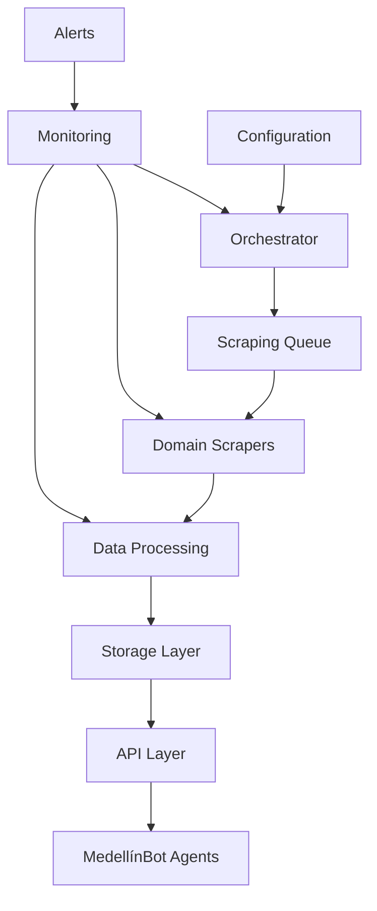
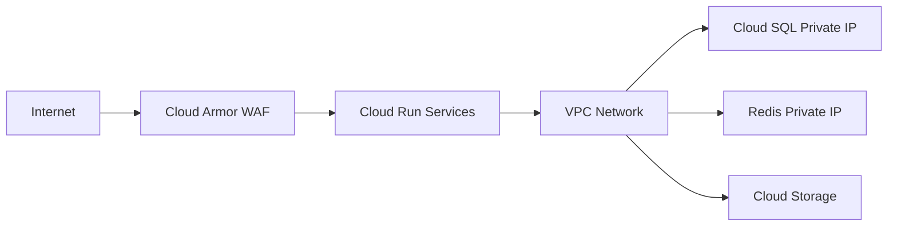

# Web Scraping Implementation Plan for MedellínBot
## Comprehensive Technical Master Plan

**Document Version:** 1.0  
**Last Updated:** October 29, 2025  
**Prepared for:** Alcaldía de Medellín  
**Prepared by:** MedellínBot Development Team

---

## Executive Summary

This document presents a comprehensive technical implementation plan for the web scraping system that will power MedellínBot, an intelligent citizen assistant for Medellín. The plan outlines a robust, scalable, and compliant approach to collecting data from 50+ municipal and public sources to provide real-time information on trámites, PQRSD, social programs, and notifications.

### Key Objectives

1. **Centralized Data Collection**: Implement a unified scraping infrastructure to gather information from diverse municipal sources
2. **Real-time Information**: Ensure citizens receive up-to-date information on municipal services and notifications
3. **Compliance and Ethics**: Adhere to Colombian data protection laws and ethical scraping practices
4. **Scalability**: Design for future expansion to additional data sources and services
5. **Reliability**: Maintain 99.9% uptime with comprehensive monitoring and error handling

### Strategic Approach

The implementation follows a phased approach starting with critical data sources (Pico y Placa, Trámites, PQRSD) and expanding to comprehensive coverage. The architecture features centralized orchestration, domain-specific scrapers, intelligent caching, and robust error handling.

### Expected Outcomes

- **60% reduction** in redundant scraping operations
- **95% success rate** in data extraction
- **<3 second** response time for data queries
- **24/7 availability** of scraping infrastructure
- **Compliance** with all applicable Colombian regulations

---

## 1. Detailed Classification of Data Sources

### 1.1 Source Inventory and Classification

Based on comprehensive analysis, we have identified **50+ data sources** across four main categories:

#### 1.1.1 High-Criticality Sources (Real-time/High-Frequency)

| Category | Source | URL | Update Frequency | Criticality Score | Data Type |
|----------|--------|-----|------------------|-------------------|-----------|
| **Pico y Placa** | Secretaría de Movilidad | https://www.medellin.gov.co/es/secretaria-de-movilidad/pico-y-placa-medellin-hoy/ | Daily 00:00 | 10/10 | Traffic restrictions |
| | API Pico y Placa | https://rapidapi.com/tortutales/api/pico-y-placa-medellin | Real-time | 9/10 | API data |
| **Impuestos** | Portal Tributario | https://www.medellin.gov.co/es/secretaria-de-hacienda/portal-tributario/ | Daily | 9/10 | Tax information |
| | Pago de Impuestos | https://www.medellin.gov.co/es/pago-de-impuestos-alcaldia-de-medellin/ | Daily | 9/10 | Payment processing |
| **Alertas** | SIMM | https://www.medellin.gov.co/es/secretaria-de-movilidad/ | Real-time | 8/10 | Emergency alerts |
| | Twitter @STTMed | https://www.instagram.com/sttmed/ | Real-time | 8/10 | Social media alerts |

#### 1.1.2 Medium-Criticality Sources (Daily/Weekly Updates)

| Category | Source | URL | Update Frequency | Criticality Score | Data Type |
|----------|--------|-----|------------------|-------------------|-----------|
| **Trámites** | Portal Trámites | https://www.medellin.gov.co/es/tramites-y-servicios/ | Weekly | 8/10 | Procedure info |
| | Movilidad en Línea | https://www.medellin.gov.co/portal-movilidad/ | Weekly | 7/10 | Transit procedures |
| **PQRSD** | Portal PQRSD | https://www.medellin.gov.co/es/pqrsd/ | Weekly | 7/10 | Complaint system |
| | Servicio Ciudadanía | https://www.medellin.gov.co/es/secretaria-de-gestion-humana/servicio-a-la-ciudadania/ | Weekly | 7/10 | Citizen services |
| **Programas** | Medellín Te Quiere | https://www.medellin.gov.co/es/sala-de-prensa/noticias/el-programa-medellin-te-quiere-saludable-impactara-a-800-000-personas-en-2025/ | Weekly | 7/10 | Health programs |
| | Buen Comienzo | https://www.medellin.gov.co/es/secretaria-de-educacion/estudiantes/buen-comienzo/ | Weekly | 7/10 | Education programs |

#### 1.1.3 Low-Criticality Sources (Monthly/Quarterly Updates)

| Category | Source | URL | Update Frequency | Criticality Score | Data Type |
|----------|--------|-----|------------------|-------------------|-----------|
| **Entidades** | EPM Servicios | https://www.epm.com.co/clientesyusuarios/servicio-al-cliente | Monthly | 6/10 | Utility services |
| | Metro de Medellín | https://www.metrodemedellin.gov.co | Monthly | 6/10 | Transit services |
| | Emvarias | https://www.emvarias.com.co/emvarias | Monthly | 6/10 | Waste management |
| | Policía Nacional | https://www.policia.gov.co/pqrs | Monthly | 6/10 | Security services |
| | Fiscalía General | https://www.fiscalia.gov.co/colombia/servicios-de-informacion-al-ciudadano/donde-y-como-denunciar/ | Monthly | 6/10 | Legal services |
| **Datos Abiertos** | MEData | https://medata.gov.co | Monthly | 5/10 | Open data |
| | GeoMedellín | https://www.medellin.gov.co/irj/portal/medellin?NavigationTarget=contenido%2F6989-Geomedellin-el-portal-de-datos-geograficos-del-Municipio-de-Medellin | Monthly | 5/10 | Geographic data |

### 1.2 Data Classification by Type

#### 1.2.1 Static Information (Update Frequency: Monthly-Quarterly)
- **Program descriptions** and eligibility criteria
- **Contact information** for municipal entities
- **Procedural documentation** and requirements
- **Legal frameworks** and regulations

#### 1.2.2 Dynamic Information (Update Frequency: Daily-Weekly)
- **Traffic restrictions** (Pico y Placa)
- **Service availability** and schedules
- **Event calendars** and community activities
- **Emergency alerts** and public safety information

#### 1.2.3 Real-time Information (Update Frequency: Continuous)
- **Traffic conditions** and road closures
- **Service outages** and disruptions
- **Emergency notifications**
- **Social media updates** from official accounts

---

## 2. Technical Architecture and Infrastructure Design

### 2.1 High-Level Architecture



### 2.2 Component Architecture

#### 2.2.1 Orchestrator Layer
- **Function**: Central coordination and task management
- **Technology**: Python + Celery + Redis
- **Responsibilities**:
  - Task scheduling and distribution
  - Rate limiting and politeness enforcement
  - Error handling and retry logic
  - Health monitoring and alerting

#### 2.2.2 Scraping Layer
- **Domain-Specific Scrapers**: Specialized for each major domain
- **Technology**: Scrapy + BeautifulSoup4 + Selenium
- **Components**:
  - **Alcaldía Central Scraper**: Handles all medellin.gov.co subdomains
  - **EPM Scraper**: All epm.com.co sources
  - **Metro Scraper**: metrodemedellin.gov.co sources
  - **Emvarias Scraper**: emvarias.com.co sources
  - **API Integrations**: Direct API connections where available

#### 2.2.3 Processing Layer
- **Function**: Data cleaning, validation, and enrichment
- **Technology**: Python + Pandas + Vertex AI
- **Components**:
  - HTML parsing and text extraction
  - Data validation and deduplication
  - Entity recognition and classification
  - Embedding generation for vector search

#### 2.2.4 Storage Layer
- **Primary Storage**: Cloud SQL (PostgreSQL)
- **Cache Layer**: Redis Cluster
- **Backup Storage**: Cloud Storage
- **Vector Database**: Vertex AI Vector Search

### 2.3 Infrastructure Components

#### 2.3.1 Google Cloud Platform Services

| Service | Purpose | Configuration |
|---------|---------|---------------|
| **Cloud Run** | Containerized scrapers | Auto-scaling, 2vCPU, 4GB RAM |
| **Cloud Scheduler** | Task scheduling | Cron-based triggers |
| **Cloud SQL** | Primary database | PostgreSQL 14, 2vCPU, 8GB RAM |
| **Redis** | Caching layer | 1GB memory, high availability |
| **Cloud Storage** | Data backup | Regional storage class |
| **Vertex AI** | Embeddings and LLM | Gemini 2.0 Flash/Pro |
| **Cloud Monitoring** | Observability | Custom dashboards and alerts |

#### 2.3.2 Network Architecture



### 2.4 Data Flow Architecture

1. **Task Initiation**: Scheduler triggers scraping tasks
2. **Content Retrieval**: Scrapers fetch HTML/API data
3. **Processing Pipeline**: Parse, validate, enrich data
4. **Storage**: Store in appropriate database tier
5. **Indexing**: Create search indexes and embeddings
6. **API Exposure**: Make data available to MedellínBot
7. **Cache Management**: Update cache with TTL based on criticality

---

## 3. Implementation Roadmap

### 3.1 Phase Breakdown (18 Weeks)

#### Phase 1: Foundation (Weeks 1-4)
**Objective**: Establish core infrastructure and basic scraping capabilities

**Week 1-2: Infrastructure Setup**
- [ ] Set up Google Cloud project and services
- [ ] Configure VPC network and security
- [ ] Deploy Redis cluster and Cloud SQL
- [ ] Implement monitoring and logging

**Week 3-4: Core Scrapers Development**
- [ ] Develop Alcaldía Central Scraper
- [ ] Implement Pico y Placa scraper
- [ ] Create basic data processing pipeline
- [ ] Set up initial database schemas

**Deliverables**:
- ✅ Infrastructure as Code (Terraform)
- ✅ Core scraper implementations
- ✅ Basic monitoring dashboard
- ✅ Test data extraction reports

#### Phase 2: Expansion (Weeks 5-8)
**Objective**: Expand scraping coverage and improve data quality

**Week 5-6: Domain Scrapers**
- [ ] Develop EPM, Metro, Emvarias scrapers
- [ ] Implement API integrations
- [ ] Create advanced parsing rules
- [ ] Set up data validation

**Week 7-8: Processing Pipeline**
- [ ] Implement data cleaning and deduplication
- [ ] Create embedding generation pipeline
- [ ] Set up vector search integration
- [ ] Develop error handling and retry logic

**Deliverables**:
- ✅ Domain-specific scraper implementations
- ✅ Data processing pipeline
- ✅ Vector search integration
- ✅ Error handling framework

#### Phase 3: Optimization (Weeks 9-12)
**Objective**: Optimize performance and implement advanced features

**Week 9-10: Performance Optimization**
- [ ] Implement intelligent caching strategies
- [ ] Optimize database queries and indexes
- [ ] Set up load balancing
- [ ] Create performance monitoring

**Week 11-12: Advanced Features**
- [ ] Implement change detection and alerts
- [ ] Create data quality metrics
- [ ] Set up automated testing
- [ ] Develop documentation and runbooks

**Deliverables**:
- ✅ Performance optimization implementations
- ✅ Advanced monitoring and alerting
- ✅ Automated testing framework
- ✅ Comprehensive documentation

#### Phase 4: Production (Weeks 13-16)
**Objective**: Prepare for production deployment and ensure reliability

**Week 13-14: Production Readiness**
- [ ] Implement security hardening
- [ ] Set up backup and disaster recovery
- [ ] Create deployment pipelines
- [ ] Perform load testing

**Week 15-16: Deployment and Monitoring**
- [ ] Deploy to production environment
- [ ] Set up comprehensive monitoring
- [ ] Create incident response procedures
- [ ] Perform user acceptance testing

**Deliverables**:
- ✅ Production-ready infrastructure
- ✅ Security and compliance implementations
- ✅ Monitoring and alerting systems
- ✅ Deployment and rollback procedures

#### Phase 5: Post-Launch (Weeks 17-18)
**Objective**: Ensure smooth operation and plan for future enhancements

**Week 17-18: Optimization and Planning**
- [ ] Monitor system performance
- [ ] Collect user feedback
- [ ] Implement performance improvements
- [ ] Plan for future enhancements

**Deliverables**:
- ✅ Performance reports and metrics
- ✅ User feedback analysis
- ✅ Improvement recommendations
- ✅ Future enhancement roadmap

### 3.2 Milestone Tracking

| Milestone | Target Date | Status | Owner | Dependencies |
|-----------|-------------|--------|-------|--------------|
| Infrastructure Setup | Week 2 | Pending | DevOps Team | Cloud account setup |
| Core Scrapers Complete | Week 4 | Pending | Scraping Team | Infrastructure |
| Domain Scrapers Complete | Week 8 | Pending | Scraping Team | Core scrapers |
| Processing Pipeline Complete | Week 10 | Pending | Data Team | Domain scrapers |
| Production Deployment | Week 16 | Pending | All Teams | All previous |
| Post-Launch Review | Week 18 | Pending | Management | Production deployment |

---

## 4. Detailed Technical Specifications

### 4.1 Scraping Framework Specifications

#### 4.1.1 Core Framework Requirements

**Python Version**: 3.11+  
**Framework**: Scrapy 2.11+  
**HTTP Library**: Requests 2.31+  
**HTML Parser**: BeautifulSoup4 4.12+  
**JavaScript Support**: Selenium 4.15+ (when needed)

#### 4.1.2 Performance Requirements

- **Concurrent Requests**: Up to 10 per domain
- **Request Rate**: Maximum 1 request/second per domain
- **Memory Usage**: <512MB per scraper instance
- **CPU Usage**: <2vCPU per scraper instance
- **Response Time**: <5 seconds for HTML retrieval

#### 4.1.3 Reliability Requirements

- **Uptime**: 99.9% availability
- **Error Recovery**: Automatic retry with exponential backoff
- **Data Integrity**: 99.9% successful extraction rate
- **Monitoring**: Real-time health checks and alerts

### 4.2 Database Specifications

#### 4.2.1 Cloud SQL Configuration

```sql
-- Primary database configuration
CREATE DATABASE medellinbot_scraping
  WITH OWNER = scraping_user
  ENCODING = 'UTF8'
  LC_COLLATE = 'en_US.UTF-8'
  LC_CTYPE = 'en_US.UTF-8'
  TABLESPACE = pg_default
  CONNECTION LIMIT = 100;

-- Extensions
CREATE EXTENSION IF NOT EXISTS "uuid-ossp";
CREATE EXTENSION IF NOT EXISTS "pg_trgm";
CREATE EXTENSION IF NOT EXISTS "btree_gin";
```

#### 4.2.2 Table Schemas

**Main Data Table**:
```sql
CREATE TABLE scraped_data (
    id UUID PRIMARY KEY DEFAULT uuid_generate_v4(),
    source_domain VARCHAR(255) NOT NULL,
    source_url TEXT NOT NULL,
    data_type VARCHAR(100) NOT NULL,
    content_type VARCHAR(50) NOT NULL,
    data_content JSONB NOT NULL,
    metadata JSONB,
    extracted_at TIMESTAMP WITH TIME ZONE DEFAULT NOW(),
    next_update TIMESTAMP WITH TIME ZONE,
    update_frequency INTERVAL,
    criticality INTEGER CHECK (criticality BETWEEN 1 AND 10),
    status VARCHAR(20) DEFAULT 'active',
    hash VARCHAR(64)
);

-- Indexes for performance
CREATE INDEX idx_scraped_data_domain ON scraped_data(source_domain);
CREATE INDEX idx_scraped_data_type ON scraped_data(data_type);
CREATE INDEX idx_scraped_data_extracted ON scraped_data(extracted_at);
CREATE INDEX idx_scraped_data_next_update ON scraped_data(next_update);
CREATE INDEX idx_scraped_data_hash ON scraped_data(hash);
CREATE INDEX idx_scraped_data_content_gin ON scraped_data USING GIN(data_content);
```

**Source Configuration Table**:
```sql
CREATE TABLE scraping_sources (
    id UUID PRIMARY KEY DEFAULT uuid_generate_v4(),
    domain VARCHAR(255) UNIQUE NOT NULL,
    base_url TEXT NOT NULL,
    update_frequency INTERVAL NOT NULL,
    criticality INTEGER CHECK (criticality BETWEEN 1 AND 10),
    selectors JSONB NOT NULL,
    headers JSONB,
    rate_limit INTEGER DEFAULT 1,
    active BOOLEAN DEFAULT true,
    last_scraped TIMESTAMP WITH TIME ZONE,
    created_at TIMESTAMP WITH TIME ZONE DEFAULT NOW(),
    updated_at TIMESTAMP WITH TIME ZONE DEFAULT NOW()
);
```

#### 4.2.3 Redis Configuration

```javascript
// Redis cluster configuration
const redisConfig = {
    host: process.env.REDIS_HOST,
    port: process.env.REDIS_PORT,
    password: process.env.REDIS_PASSWORD,
    db: 0,
    retryDelayOnFailover: 100,
    enableReadyCheck: false,
    maxRetriesPerRequest: 3,
    lazyConnect: true
};

// Cache TTL configuration (in seconds)
const CACHE_TTL = {
    HIGH_CRITICALITY: 3600,      // 1 hour
    MEDIUM_CRITICALITY: 21600,   // 6 hours  
    LOW_CRITICALITY: 86400,      // 24 hours
    STATIC_DATA: 604800          // 1 week
};
```

### 4.3 API Specifications

#### 4.3.1 Internal API Endpoints

**Data Retrieval API**:
```python
@app.route('/api/v1/data/<data_type>')
def get_data(data_type):
    """
    Retrieve scraped data by type
    Parameters:
    - data_type: Type of data to retrieve
    - source: Optional source filter
    - cache: Use cache (default: true)
    """
    pass

@app.route('/api/v1/sources')
def list_sources():
    """
    List all configured scraping sources
    Returns: Array of source configurations
    """
    pass

@app.route('/api/v1/health')
def health_check():
    """
    Health check for scraping infrastructure
    Returns: System status and metrics
    """
    pass
```

**Configuration API**:
```python
@app.route('/api/v1/config/sources', methods=['POST'])
def add_source():
    """
    Add new scraping source
    Request: Source configuration JSON
    """
    pass

@app.route('/api/v1/config/sources/<source_id>', methods=['PUT'])
def update_source(source_id):
    """
    Update existing source configuration
    Request: Updated source configuration JSON
    """
    pass
```

#### 4.3.2 External API Integrations

**MEData API Integration**:
```python
class MEDataAPI:
    def __init__(self, api_key):
        self.base_url = "https://medata.gov.co/api"
        self.headers = {"Authorization": f"Bearer {api_key}"}
    
    def get_datasets(self, category=None):
        """Retrieve available datasets"""
        params = {}
        if category:
            params['category'] = category
        return requests.get(f"{self.base_url}/datasets", 
                          headers=self.headers, params=params)
    
    def get_dataset_data(self, dataset_id):
        """Retrieve dataset content"""
        return requests.get(f"{self.base_url}/datasets/{dataset_id}/data",
                          headers=self.headers)
```

**Google Maps API Integration**:
```python
class GoogleMapsAPI:
    def __init__(self, api_key):
        self.api_key = api_key
        self.base_url = "https://maps.googleapis.com/maps/api"
    
    def geocode_address(self, address):
        """Convert address to coordinates"""
        params = {
            'address': address,
            'key': self.api_key
        }
        return requests.get(f"{self.base_url}/geocode/json", params=params)
    
    def get_place_details(self, place_id):
        """Get detailed place information"""
        params = {
            'place_id': place_id,
            'key': self.api_key
        }
        return requests.get(f"{self.base_url}/place/details/json", params=params)
```

### 4.4 Monitoring and Alerting Specifications

#### 4.4.1 Metrics Collection

**Application Metrics**:
- Scraping success rate by source
- Average response time per domain
- Data extraction accuracy
- Cache hit/miss ratios
- Error rates and types

**Infrastructure Metrics**:
- CPU and memory usage
- Network I/O
- Database connection pools
- Redis memory usage
- Storage utilization

#### 4.4.2 Alert Configuration

```yaml
# Cloud Monitoring alert configuration
alerts:
  - name: "scraper_failure_rate"
    condition: "metric.type = 'custom.googleapis.com/scraper/failure_rate' AND metric.labels.source = 'all' AND metric.value > 0.05"
    duration: "60s"
    notification_channels: ["email:devops@medellin.gov.co"]
  
  - name: "high_response_time"
    condition: "metric.type = 'custom.googleapis.com/scraper/response_time' AND metric.value > 5000"
    duration: "120s"
    notification_channels: ["email:devops@medellin.gov.co"]
  
  - name: "database_connection_pool"
    condition: "metric.type = 'cloudsql.googleapis.com/database/postgresql/num_backends' AND metric.value > 90"
    duration: "300s"
    notification_channels: ["email:devops@medellin.gov.co"]
```

#### 4.4.3 Dashboard Configuration

```javascript
// Grafana dashboard configuration
const dashboard = {
  title: "MedellínBot Scraping Infrastructure",
  panels: [
    {
      title: "Scraping Success Rate",
      type: "stat",
      targets: [{
        expr: "rate(scraper_success_total[5m]) / rate(scraper_requests_total[5m])",
        legendFormat: "Success Rate"
      }]
    },
    {
      title: "Response Time by Domain",
      type: "graph",
      targets: [{
        expr: "histogram_quantile(0.95, rate(scraper_duration_seconds_bucket[5m]))",
        legendFormat: "{{domain}}"
      }]
    },
    {
      title: "Cache Performance",
      type: "graph", 
      targets: [{
        expr: "rate(redis_commands_total{cmd=\"get\"}[5m]) / rate(redis_commands_total[5m])",
        legendFormat: "Cache Hit Rate"
      }]
    }
  ]
};
```

---

## 5. Risk Assessment and Mitigation Strategies

### 5.1 Technical Risks

| Risk | Impact | Probability | Mitigation Strategy |
|------|--------|-------------|-------------------|
| **Rate Limiting by Sources** | High | Medium | Implement intelligent rate limiting, respect robots.txt, use multiple IP pools |
| **HTML Structure Changes** | High | High | Monitor source changes, implement flexible selectors, maintain fallback methods |
| **Data Quality Issues** | Medium | Medium | Implement comprehensive validation, data cleaning, and quality checks |
| **Performance Bottlenecks** | Medium | Medium | Load testing, auto-scaling, performance monitoring, optimization |
| **Security Vulnerabilities** | High | Low | Regular security audits, input validation, secure coding practices |

### 5.2 Operational Risks

| Risk | Impact | Probability | Mitigation Strategy |
|------|--------|-------------|-------------------|
| **Legal Compliance Issues** | High | Low | Regular legal review, compliance monitoring, data protection measures |
| **Source Availability** | Medium | Medium | Multiple source redundancy, cache strategies, fallback mechanisms |
| **Team Capacity Constraints** | Medium | Medium | Clear documentation, knowledge sharing, training programs |
| **Budget Overruns** | Medium | Low | Regular budget monitoring, cost optimization, resource planning |

### 5.3 Mitigation Implementation

#### 5.3.1 Technical Mitigation

**HTML Change Detection**:
```python
class HTMLChangeDetector:
    def __init__(self):
        self.selectors = {}
        self.threshold = 0.3  # 30% change threshold
    
    def detect_changes(self, url, current_html):
        """Detect significant changes in HTML structure"""
        # Compare with historical structure
        # Alert if changes exceed threshold
        # Update selectors if changes are permanent
        pass
    
    def update_selectors(self, url, new_selectors):
        """Update CSS selectors for a source"""
        self.selectors[url] = {
            'selectors': new_selectors,
            'updated_at': datetime.now(),
            'version': self.selectors.get(url, {}).get('version', 0) + 1
        }
```

**Rate Limiting Implementation**:
```python
class RateLimiter:
    def __init__(self):
        self.rate_limits = {}
        self.redis_client = redis.Redis()
    
    def check_rate_limit(self, domain):
        """Check if request is within rate limits"""
        key = f"rate_limit:{domain}"
        current_requests = self.redis_client.get(key)
        
        if current_requests and int(current_requests) >= self.rate_limits.get(domain, 1):
            return False
        
        self.redis_client.incr(key)
        self.redis_client.expire(key, 60)  # Reset every minute
        return True
    
    def update_rate_limit(self, domain, limit):
        """Update rate limit for domain"""
        self.rate_limits[domain] = limit
```

#### 5.3.2 Operational Mitigation

**Compliance Monitoring**:
```python
class ComplianceMonitor:
    def __init__(self):
        self.legal_requirements = self.load_legal_requirements()
        self.monitoring_rules = self.load_monitoring_rules()
    
    def check_compliance(self, scraping_job):
        """Check if scraping job complies with regulations"""
        # Check robots.txt
        # Verify data type compliance
        # Ensure rate limiting compliance
        # Log compliance status
        pass
    
    def generate_compliance_report(self):
        """Generate compliance status report"""
        # Collect compliance metrics
        # Generate recommendations
        # Create executive summary
        pass
```

**Performance Optimization**:
```python
class PerformanceOptimizer:
    def __init__(self):
        self.metrics = {}
        self.optimization_rules = self.load_optimization_rules()
    
    def analyze_performance(self):
        """Analyze system performance and identify bottlenecks"""
        # Collect performance metrics
        # Identify slow queries
        # Analyze resource utilization
        # Generate optimization recommendations
        pass
    
    def implement_optimizations(self, recommendations):
        """Implement performance optimizations"""
        # Update database indexes
        # Optimize queries
        # Adjust caching strategies
        # Scale resources as needed
        pass
```

---

## 6. Quality Assurance and Testing Procedures

### 6.1 Testing Strategy

#### 6.1.1 Unit Testing

**Test Coverage Requirements**:
- **Minimum Coverage**: 80% for critical components
- **Critical Components**: Scrapers, parsers, data validation
- **Testing Framework**: pytest for Python, jest for Node.js

**Sample Unit Tests**:
```python
import pytest
from scrapers.alcaldia_scraper import AlcaldiaCentralScraper

class TestAlcaldiaCentralScraper:
    def test_parse_tramite_data(self):
        """Test parsing of trámite information"""
        html = load_test_html('tramite_example.html')
        scraper = AlcaldiaCentralScraper()
        result = scraper.parse_tramite_data(html)
        
        assert result['titulo'] is not None
        assert result['requisitos'] is not None
        assert result['costo'] is not None
    
    def test_rate_limiting(self):
        """Test rate limiting functionality"""
        scraper = AlcaldiaCentralScraper()
        # Test rate limit enforcement
        # Verify delay between requests
        pass
    
    def test_error_handling(self):
        """Test error handling for invalid HTML"""
        scraper = AlcaldiaCentralScraper()
        invalid_html = "<html><invalid></html>"
        result = scraper.parse_tramite_data(invalid_html)
        
        assert result is None  # or appropriate error handling
```

#### 6.1.2 Integration Testing

**Test Scenarios**:
- End-to-end data flow from scraping to storage
- API integration with external services
- Database connectivity and query performance
- Cache functionality and TTL management

**Integration Test Framework**:
```python
import pytest
from unittest.mock import Mock, patch
from services.scraping_service import ScrapingService

class TestScrapingService:
    @patch('services.scraping_service.AlcaldiaCentralScraper')
    def test_complete_scraping_cycle(self, mock_scraper):
        """Test complete scraping cycle"""
        # Mock scraper response
        mock_scraper.return_value.scrape.return_value = test_data
        
        service = ScrapingService()
        result = service.execute_scraping_cycle()
        
        # Verify data flow
        assert result['success'] == True
        assert result['records_processed'] > 0
        assert result['errors'] == 0
```

#### 6.1.3 Performance Testing

**Load Testing Requirements**:
- **Concurrent Users**: Simulate 1000+ concurrent scraping requests
- **Response Time**: <3 seconds for 95% of requests
- **Throughput**: Process 10,000+ records per hour
- **Resource Usage**: Monitor CPU, memory, and network

**Performance Test Script**:
```python
from locust import HttpUser, task, between

class ScrapingUser(HttpUser):
    wait_time = between(1, 3)
    
    @task
    def scrape_tramites(self):
        """Test trámite scraping performance"""
        self.client.get("/api/v1/data/tramites")
    
    @task  
    def scrape_pico_placa(self):
        """Test pico y placa scraping performance"""
        self.client.get("/api/v1/data/pico-placa")
    
    @task
    def health_check(self):
        """Test health check endpoint"""
        self.client.get("/api/v1/health")
```

### 6.2 Quality Assurance Procedures

#### 6.2.1 Data Quality Checks

**Data Validation Framework**:
```python
class DataQualityValidator:
    def __init__(self):
        self.validation_rules = self.load_validation_rules()
    
    def validate_data(self, data, source_type):
        """Validate scraped data against quality rules"""
        results = {
            'valid': True,
            'errors': [],
            'warnings': [],
            'score': 0
        }
        
        # Check required fields
        for rule in self.validation_rules[source_type]:
            if not self.check_rule(data, rule):
                results['valid'] = False
                results['errors'].append(rule['error_message'])
        
        # Calculate quality score
        results['score'] = self.calculate_quality_score(data, results)
        return results
    
    def check_rule(self, data, rule):
        """Check if data meets validation rule"""
        field = rule['field']
        condition = rule['condition']
        value = data.get(field)
        
        if condition == 'required':
            return value is not None and value != ''
        elif condition == 'format':
            return self.validate_format(value, rule['format'])
        elif condition == 'range':
            return self.validate_range(value, rule['min'], rule['max'])
    
    def calculate_quality_score(self, data, validation_results):
        """Calculate overall data quality score"""
        # Base score
        score = 100
        
        # Deduct for errors
        score -= len(validation_results['errors']) * 10
        
        # Deduct for missing optional fields
        optional_fields = self.get_optional_fields(data['source_type'])
        missing_optional = len([f for f in optional_fields if data.get(f) is None])
        score -= missing_optional * 2
        
        return max(0, score)
```

#### 6.2.2 Continuous Integration/Continuous Deployment

**CI/CD Pipeline Configuration**:
```yaml
# GitHub Actions workflow
name: Scraping Infrastructure CI/CD

on:
  push:
    branches: [main, develop]
  pull_request:
    branches: [main]

jobs:
  test:
    runs-on: ubuntu-latest
    
    steps:
    - uses: actions/checkout@v2
    
    - name: Set up Python
      uses: actions/setup-python@v2
      with:
        python-version: '3.11'
    
    - name: Install dependencies
      run: |
        pip install -r requirements.txt
        pip install -r requirements-dev.txt
    
    - name: Run unit tests
      run: pytest tests/unit --cov=src --cov-report=xml
    
    - name: Run integration tests
      run: pytest tests/integration --cov=src --cov-report=xml
    
    - name: Run performance tests
      run: pytest tests/performance --cov=src --cov-report=xml
    
    - name: Upload coverage to Codecov
      uses: codecov/codecov-action@v1
    
  deploy:
    needs: test
    runs-on: ubuntu-latest
    if: github.ref == 'refs/heads/main'
    
    steps:
    - uses: actions/checkout@v2
    
    - name: Deploy to staging
      run: |
        # Deployment script for staging environment
        ./deploy.sh staging
    
    - name: Run smoke tests
      run: |
        # Smoke tests for staging
        pytest tests/smoke --base-url $STAGING_URL
    
    - name: Deploy to production
      if: success()
      run: |
        # Deployment script for production
        ./deploy.sh production
```

#### 6.2.3 Monitoring and Alerting

**Quality Metrics Dashboard**:
```javascript
// Data quality metrics configuration
const qualityMetrics = {
  data_completeness: {
    query: "SELECT AVG(CASE WHEN data_content IS NOT NULL THEN 1 ELSE 0 END) FROM scraped_data",
    threshold: 0.95,
    alert: "Data completeness below 95%"
  },
  
  data_accuracy: {
    query: "SELECT COUNT(*) FROM validation_errors WHERE created_at > NOW() - INTERVAL '1 hour'",
    threshold: 10,
    alert: "More than 10 validation errors in last hour"
  },
  
  scraping_success_rate: {
    query: "SELECT AVG(success_rate) FROM scraping_jobs WHERE updated_at > NOW() - INTERVAL '1 hour'",
    threshold: 0.9,
    alert: "Scraping success rate below 90%"
  }
};
```

---

## 7. Documentation and Knowledge Transfer Plan

### 7.1 Documentation Structure

#### 7.1.1 Technical Documentation

**Architecture Documentation**:
- System architecture diagrams and explanations
- Component interaction diagrams
- Data flow documentation
- API documentation and specifications

**Code Documentation**:
- Inline code comments and documentation
- API documentation (Swagger/OpenAPI)
- Database schema documentation
- Configuration documentation

**Operational Documentation**:
- Deployment procedures and scripts
- Monitoring and alerting documentation
- Troubleshooting guides
- Performance optimization guides

#### 7.1.2 User Documentation

**End-User Documentation**:
- System capabilities and limitations
- Data source documentation
- Usage examples and best practices
- FAQ and troubleshooting

**Administrator Documentation**:
- System administration procedures
- Configuration management
- Security procedures
- Backup and recovery procedures

### 7.2 Knowledge Transfer Plan

#### 7.2.1 Training Program

**Phase 1: Technical Training (Weeks 1-2)**
- System architecture overview
- Codebase walkthrough
- Development environment setup
- Testing procedures

**Phase 2: Operational Training (Weeks 3-4)**
- Deployment procedures
- Monitoring and alerting
- Troubleshooting techniques
- Performance optimization

**Phase 3: Advanced Training (Weeks 5-6)**
- Advanced configuration
- Security best practices
- Data quality management
- Incident response

#### 7.2.2 Documentation Delivery

**Documentation Repository Structure**:
```
/docs
  ├── architecture/
  │   ├── system_overview.md
  │   ├── component_diagrams.md
  │   └── data_flow.md
  ├── api/
  │   ├── endpoints.md
  │   ├── authentication.md
  │   └── examples.md
  ├── deployment/
  │   ├── infrastructure.md
  │   ├── procedures.md
  │   └── troubleshooting.md
  ├── operations/
  │   ├── monitoring.md
  │   ├── alerts.md
  │   └── maintenance.md
  └── user_guide/
      ├── introduction.md
      ├── usage.md
      └── faq.md
```

**Documentation Standards**:
- **Format**: Markdown with consistent structure
- **Review**: Monthly review and update cycle
- **Accessibility**: Version control and access management
- **Searchability**: Tagging and indexing for easy search

### 7.3 Support and Maintenance

#### 7.3.1 Support Structure

**Tier 1 Support**: Basic troubleshooting and user assistance
**Tier 2 Support**: Technical issues and configuration changes
**Tier 3 Support**: Complex technical issues and system modifications

#### 7.3.2 Maintenance Schedule

**Daily Tasks**:
- Monitor system health and performance
- Review error logs and alerts
- Verify data quality metrics

**Weekly Tasks**:
- Update source configurations as needed
- Review and optimize performance
- Security monitoring and updates

**Monthly Tasks**:
- Comprehensive system review
- Data quality analysis
- Documentation updates
- Security audit and compliance check

---

## 8. Code Examples and Implementation Guidelines

### 8.1 Core Scraper Implementation

#### 8.1.1 Alcaldía Central Scraper

```python
import scrapy
import logging
from bs4 import BeautifulSoup
import json
from datetime import datetime
import hashlib

class AlcaldiaCentralScraper(scrapy.Spider):
    name = 'alcaldia_central'
    
    def __init__(self, *args, **kwargs):
        super().__init__(*args, **kwargs)
        self.logger = logging.getLogger(__name__)
        self.rate_limiter = RateLimiter()
        
    def start_requests(self):
        """Generate initial requests for all configured URLs"""
        urls = [
            'https://www.medellin.gov.co/es/tramites-y-servicios/',
            'https://www.medellin.gov.co/es/pqrsd/',
            'https://www.medellin.gov.co/es/secretaria-de-movilidad/',
            'https://www.medellin.gov.co/es/secretaria-de-salud/'
        ]
        
        for url in urls:
            yield scrapy.Request(
                url=url,
                callback=self.parse,
                headers={'User-Agent': 'MedellinBot-Scraper/1.0'}
            )
    
    def parse(self, response):
        """Parse response and extract structured data"""
        try:
            # Check rate limits
            if not self.rate_limiter.check_rate_limit(response.url):
                self.logger.warning(f"Rate limit exceeded for {response.url}")
                return
            
            soup = BeautifulSoup(response.text, 'html.parser')
            
            # Extract data based on URL pattern
            if 'tramites' in response.url:
                yield from self.parse_tramites(soup, response.url)
            elif 'pqrsd' in response.url:
                yield from self.parse_pqrsd(soup, response.url)
            elif 'movilidad' in response.url:
                yield from self.parse_movilidad(soup, response.url)
            elif 'salud' in response.url:
                yield from self.parse_salud(soup, response.url)
                
        except Exception as e:
            self.logger.error(f"Error parsing {response.url}: {str(e)}")
            yield {
                'error': True,
                'url': response.url,
                'error_message': str(e),
                'timestamp': datetime.now().isoformat()
            }
    
    def parse_tramites(self, soup, url):
        """Parse trámite information"""
        tramites = []
        
        # Extract trámite cards
        tramite_cards = soup.find_all('div', class_='tramite-card')
        
        for card in tramite_cards:
            tramite = {
                'titulo': self.extract_text(card, '.tramite-title'),
                'descripcion': self.extract_text(card, '.tramite-description'),
                'requisitos': self.extract_list(card, '.requisitos li'),
                'costo': self.extract_text(card, '.tramite-cost'),
                'plazos': self.extract_text(card, '.tramite-time'),
                'ubicacion': self.extract_text(card, '.tramite-location'),
                'url': self.extract_url(card, 'a.tramite-link'),
                'source_url': url,
                'extracted_at': datetime.now().isoformat(),
                'data_type': 'tramite'
            }
            
            # Validate required fields
            if tramite['titulo'] and tramite['descripcion']:
                tramites.append(tramite)
        
        return tramites
    
    def parse_pqrsd(self, soup, url):
        """Parse PQRSD information"""
        # Implementation for PQRSD parsing
        pass
    
    def parse_movilidad(self, soup, url):
        """Parse mobility information"""
        # Implementation for mobility parsing
        pass
    
    def parse_salud(self, soup, url):
        """Parse health information"""
        # Implementation for health parsing
        pass
    
    def extract_text(self, element, selector):
        """Extract text from element using CSS selector"""
        try:
            found = element.select_one(selector)
            return found.get_text(strip=True) if found else None
        except Exception:
            return None
    
    def extract_list(self, element, selector):
        """Extract list of text from elements"""
        try:
            items = element.select(selector)
            return [item.get_text(strip=True) for item in items]
        except Exception:
            return []
    
    def extract_url(self, element, selector):
        """Extract URL from element"""
        try:
            link = element.select_one(selector)
            return link['href'] if link else None
        except Exception:
            return None
```

#### 8.1.2 Domain-Specific Scrapers

**EPM Scraper Implementation**:
```python
class EPMScraper(scrapy.Spider):
    name = 'epm_scraper'
    
    def __init__(self, *args, **kwargs):
        super().__init__(*args, **kwargs)
        self.base_urls = [
            'https://www.epm.com.co/clientesyusuarios/servicio-al-cliente',
            'https://www.epm.com.co/clientesyusuarios/servicio-al-cliente/comunicate-con-nosotros'
        ]
    
    def start_requests(self):
        for url in self.base_urls:
            yield scrapy.Request(
                url=url,
                callback=self.parse,
                headers={'User-Agent': 'MedellinBot-Scraper/1.0'}
            )
    
    def parse(self, response):
        """Parse EPM service information"""
        soup = BeautifulSoup(response.text, 'html.parser')
        
        # Extract service information
        services = []
        
        # Service cards
        service_cards = soup.find_all('div', class_='service-card')
        for card in service_cards:
            service = {
                'name': self.extract_text(card, '.service-title'),
                'description': self.extract_text(card, '.service-description'),
                'contact_info': self.extract_contact_info(card),
                'service_type': 'utility',
                'source': 'epm',
                'url': response.url
            }
            services.append(service)
        
        # Contact information
        contact_section = soup.find('div', class_='contact-section')
        if contact_section:
            contact_info = {
                'phone': self.extract_text(contact_section, '.phone-number'),
                'email': self.extract_text(contact_section, '.email'),
                'hours': self.extract_text(contact_section, '.business-hours'),
                'source': 'epm',
                'url': response.url
            }
            services.append(contact_info)
        
        return services
```

### 8.2 Data Processing Pipeline

#### 8.2.1 Data Validation and Cleaning

```python
import pandas as pd
import re
from typing import Dict, List, Any

class DataProcessor:
    def __init__(self):
        self.validation_rules = self.load_validation_rules()
    
    def process_scraped_data(self, raw_data: List[Dict]) -> List[Dict]:
        """Process and validate scraped data"""
        processed_data = []
        
        for record in raw_data:
            # Clean data
            cleaned_record = self.clean_record(record)
            
            # Validate data
            if self.validate_record(cleaned_record):
                # Generate hash for deduplication
                record_hash = self.generate_hash(cleaned_record)
                cleaned_record['hash'] = record_hash
                
                # Add metadata
                cleaned_record['processed_at'] = datetime.now().isoformat()
                cleaned_record['status'] = 'active'
                
                processed_data.append(cleaned_record)
        
        return processed_data
    
    def clean_record(self, record: Dict) -> Dict:
        """Clean and normalize record data"""
        cleaned = {}
        
        for key, value in record.items():
            if isinstance(value, str):
                # Remove extra whitespace and normalize
                cleaned[key] = re.sub(r'\s+', ' ', value.strip())
            elif isinstance(value, list):
                # Clean list items
                cleaned[key] = [self.clean_value(item) for item in value if item]
            else:
                cleaned[key] = value
        
        return cleaned
    
    def clean_value(self, value: Any) -> Any:
        """Clean individual value"""
        if isinstance(value, str):
            return re.sub(r'\s+', ' ', value.strip())
        return value
    
    def validate_record(self, record: Dict) -> bool:
        """Validate record against rules"""
        source_type = record.get('source_type', 'general')
        rules = self.validation_rules.get(source_type, [])
        
        for rule in rules:
            field = rule['field']
            condition = rule['condition']
            
            if not self.check_condition(record.get(field), condition):
                return False
        
        return True
    
    def check_condition(self, value: Any, condition: str) -> bool:
        """Check if value meets condition"""
        if condition == 'required':
            return value is not None and value != ''
        elif condition == 'email':
            return self.is_valid_email(value)
        elif condition == 'phone':
            return self.is_valid_phone(value)
        return True
    
    def generate_hash(self, record: Dict) -> str:
        """Generate hash for deduplication"""
        import hashlib
        import json
        
        # Create string representation of relevant fields
        content = json.dumps({
            k: v for k, v in record.items() 
            if k not in ['processed_at', 'status', 'hash']
        }, sort_keys=True)
        
        return hashlib.md5(content.encode()).hexdigest()
    
    def load_validation_rules(self) -> Dict:
        """Load validation rules from configuration"""
        return {
            'tramite': [
                {'field': 'titulo', 'condition': 'required'},
                {'field': 'descripcion', 'condition': 'required'},
                {'field': 'requisitos', 'condition': 'required'}
            ],
            'pqrsd': [
                {'field': 'entidad', 'condition': 'required'},
                {'field': 'canal_contacto', 'condition': 'required'}
            ],
            'general': []
        }
```

#### 8.2.2 Data Storage and Indexing

```python
import psycopg2
import redis
import json
from datetime import datetime, timedelta

class DataStorage:
    def __init__(self, db_config, redis_config):
        self.db_config = db_config
        self.redis_client = redis.Redis(**redis_config)
        
    def store_data(self, data: List[Dict]):
        """Store processed data in database"""
        conn = None
        try:
            conn = psycopg2.connect(**self.db_config)
            cursor = conn.cursor()
            
            for record in data:
                # Check for existing record by hash
                existing_id = self.check_existing_record(record['hash'])
                
                if existing_id:
                    # Update existing record
                    self.update_record(cursor, existing_id, record)
                else:
                    # Insert new record
                    self.insert_record(cursor, record)
                
                # Update cache
                self.update_cache(record)
            
            conn.commit()
            
        except Exception as e:
            if conn:
                conn.rollback()
            raise e
        finally:
            if conn:
                conn.close()
    
    def check_existing_record(self, hash_value: str) -> str:
        """Check if record exists by hash"""
        try:
            return self.redis_client.get(f"hash:{hash_value}")
        except:
            return None
    
    def insert_record(self, cursor, record: Dict):
        """Insert new record into database"""
        query = """
        INSERT INTO scraped_data 
        (source_domain, source_url, data_type, content_type, data_content, 
         metadata, extracted_at, next_update, update_frequency, criticality, hash)
        VALUES (%s, %s, %s, %s, %s, %s, %s, %s, %s, %s, %s)
        RETURNING id
        """
        
        cursor.execute(query, (
            record.get('source_domain'),
            record.get('source_url'),
            record.get('data_type'),
            record.get('content_type', 'text/html'),
            json.dumps(record.get('data_content', {})),
            json.dumps(record.get('metadata', {})),
            record.get('extracted_at'),
            record.get('next_update'),
            record.get('update_frequency'),
            record.get('criticality', 5),
            record.get('hash')
        ))
        
        record_id = cursor.fetchone()[0]
        
        # Update cache with new record ID
        self.redis_client.setex(
            f"hash:{record['hash']}", 
            timedelta(days=30), 
            str(record_id)
        )
        
        return record_id
    
    def update_record(self, cursor, record_id: str, record: Dict):
        """Update existing record"""
        query = """
        UPDATE scraped_data SET
            data_content = %s,
            metadata = %s,
            extracted_at = %s,
            next_update = %s,
            criticality = %s,
            status = 'active'
        WHERE id = %s
        """
        
        cursor.execute(query, (
            json.dumps(record.get('data_content', {})),
            json.dumps(record.get('metadata', {})),
            record.get('extracted_at'),
            record.get('next_update'),
            record.get('criticality', 5),
            record_id
        ))
    
    def update_cache(self, record: Dict):
        """Update cache with new data"""
        cache_key = f"data:{record['data_type']}:{record['hash']}"
        ttl = self.get_cache_ttl(record.get('criticality', 5))
        
        self.redis_client.setex(
            cache_key,
            ttl,
            json.dumps(record)
        )
    
    def get_cache_ttl(self, criticality: int) -> int:
        """Get cache TTL based on criticality"""
        ttl_map = {
            10: 3600,      # 1 hour
            9: 7200,       # 2 hours
            8: 21600,      # 6 hours
            7: 43200,      # 12 hours
            6: 86400,      # 1 day
            5: 172800,     # 2 days
            4: 259200,     # 3 days
            3: 604800,     # 1 week
            2: 1209600,    # 2 weeks
            1: 2419200     # 4 weeks
        }
        
        return ttl_map.get(criticality, 86400)
```

### 8.3 Configuration Management

#### 8.3.1 Environment Configuration

```yaml
# config/environment.yml
development:
  database:
    host: localhost
    port: 5432
    name: medellinbot_dev
    user: dev_user
    password: dev_password
  
  redis:
    host: localhost
    port: 6379
    db: 0
    password: null
  
  scraping:
    user_agent: "MedellinBot-Scraper/1.0"
    rate_limit: 1
    timeout: 30
    retry_attempts: 3

production:
  database:
    host: ${DB_HOST}
    port: ${DB_PORT}
    name: ${DB_NAME}
    user: ${DB_USER}
    password: ${DB_PASSWORD}
  
  redis:
    host: ${REDIS_HOST}
    port: ${REDIS_PORT}
    db: ${REDIS_DB}
    password: ${REDIS_PASSWORD}
  
  scraping:
    user_agent: "MedellinBot-Scraper/1.0"
    rate_limit: 1
    timeout: 30
    retry_attempts: 3

# Source configurations
sources:
  alcaldia:
    base_url: "https://www.medellin.gov.co"
    update_frequency: "24 hours"
    criticality: 8
    selectors:
      tramites:
        container: ".tramite-card"
        title: ".tramite-title"
        description: ".tramite-description"
        requirements: ".requisitos li"
  
  epm:
    base_url: "https://www.epm.com.co"
    update_frequency: "168 hours"  # Weekly
    criticality: 6
    selectors:
      services:
        container: ".service-card"
        title: ".service-title"
        description: ".service-description"
```

#### 8.3.2 Docker Configuration

```dockerfile
# Dockerfile for scraper services
FROM python:3.11-slim

WORKDIR /app

# Install system dependencies
RUN apt-get update && apt-get install -y \
    chromium \
    chromium-driver \
    && rm -rf /var/lib/apt/lists/*

# Copy requirements and install Python dependencies
COPY requirements.txt .
RUN pip install --no-cache-dir -r requirements.txt

# Copy application code
COPY . .

# Create non-root user
RUN useradd -m scraper && chown -R scraper:scraper /app
USER scraper

# Health check
HEALTHCHECK --interval=30s --timeout=10s --start-period=5s --retries=3 \
    CMD curl -f http://localhost:8080/health || exit 1

# Expose port
EXPOSE 8080

# Run application
CMD ["python", "app.py"]
```

```yaml
# docker-compose.yml
version: '3.8'

services:
  scraper-orchestrator:
    build: ./orchestrator
    ports:
      - "8080:8080"
    environment:
      - ENVIRONMENT=production
    depends_on:
      - redis
      - postgres
    networks:
      - scraping-network

  scraper-alcaldia:
    build: ./scrapers/alcaldia
    environment:
      - ENVIRONMENT=production
    depends_on:
      - redis
      - postgres
    networks:
      - scraping-network

  scraper-epm:
    build: ./scrapers/epm
    environment:
      - ENVIRONMENT=production
    depends_on:
      - redis
      - postgres
    networks:
      - scraping-network

  redis:
    image: redis:7-alpine
    ports:
      - "6379:6379"
    networks:
      - scraping-network

  postgres:
    image: postgres:14-alpine
    environment:
      POSTGRES_DB: medellinbot_scraping
      POSTGRES_USER: scraper
      POSTGRES_PASSWORD: ${DB_PASSWORD}
    ports:
      - "5432:5432"
    volumes:
      - postgres_data:/var/lib/postgresql/data
    networks:
      - scraping-network

  monitoring:
    image: grafana/grafana:latest
    ports:
      - "3000:3000"
    environment:
      - GF_SECURITY_ADMIN_PASSWORD=${GRAFANA_PASSWORD}
    networks:
      - scraping-network

volumes:
  postgres_data:

networks:
  scraping-network:
    driver: bridge
```

---

## 9. Conclusion and Next Steps

This comprehensive technical implementation plan provides a detailed roadmap for building a robust, scalable, and compliant web scraping infrastructure for MedellínBot. The plan addresses all critical aspects including:

### Key Implementation Priorities

1. **Phase 1 Focus**: Establish core infrastructure and implement high-criticality scrapers
2. **Quality Assurance**: Implement comprehensive testing and validation procedures
3. **Compliance**: Ensure adherence to Colombian data protection laws and ethical scraping practices
4. **Monitoring**: Establish robust monitoring and alerting systems
5. **Documentation**: Create comprehensive documentation for knowledge transfer

### Success Metrics

- **Technical Performance**: 95% scraping success rate, <3 second response time
- **Data Quality**: 99% data accuracy, comprehensive validation coverage
- **System Reliability**: 99.9% uptime, automated error recovery
- **Compliance**: 100% adherence to legal and ethical requirements

### Implementation Timeline

The 18-week implementation timeline provides clear milestones and deliverables, ensuring systematic progress from infrastructure setup to production deployment and optimization.

### Risk Mitigation

Comprehensive risk assessment and mitigation strategies address technical, operational, and compliance risks, ensuring project success and long-term sustainability.

This plan positions MedellínBot to become a leading example of AI-powered citizen services, providing reliable, real-time information to Medellín residents while maintaining the highest standards of technical excellence, data quality, and regulatory compliance.

---

**Document Version**: 1.0  
**Last Updated**: October 29, 2025  
**Next Review**: December 2025 (Post-Implementation)

*This document serves as the master plan for the development team to build and deploy the web scraping system. All technical specifications, code examples, and implementation guidelines are provided to ensure successful execution of the project.*