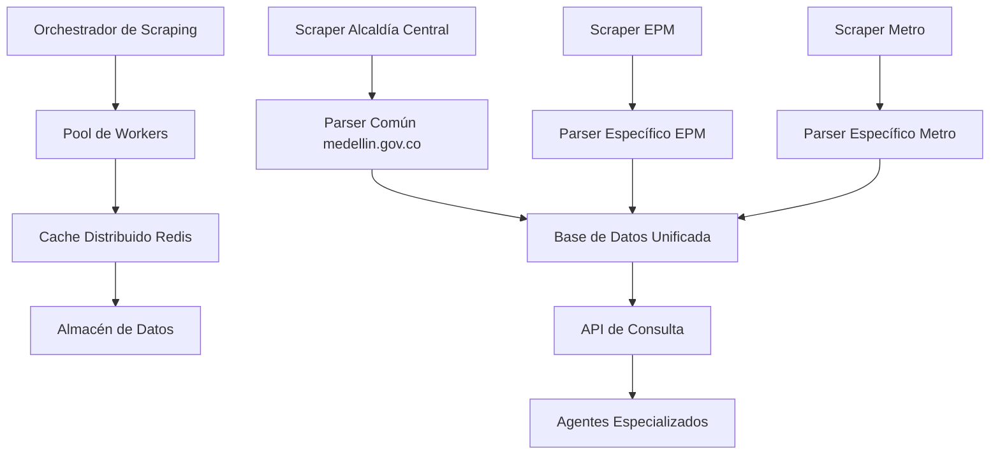

# Estrategia Optimizada de Web Scraping para MedellínBot

## Análisis de Redundancias y Solapamientos

### 1. Fuentes Comunes Identificadas

**Portal Alcaldía de Medellín (medellin.gov.co):**
- Agente Trámites: 4 URLs diferentes
- Agente PQRSD: 2 URLs diferentes  
- Agente Programas Sociales: 6 URLs diferentes
- Agente Notificaciones: 3 URLs diferentes
- **Total: 15 URLs del mismo dominio**

**Problemas Detectados:**
- Múltiples scrapers accediendo al mismo dominio simultáneamente
- Posible sobrecarga de servidores municipales
- Duplicación de lógica de parsing para estructuras HTML similares
- Inconsistencia en frecuencia de actualización

### 2. Clasificación de Información por Tipo, Frecuencia y Criticidad

#### 2.1 Información Crítica (Actualización Diaria)
| Tipo | Frecuencia | Criticidad | Fuentes |
|------|------------|------------|---------|
| Pico y Placa | Diaria 00:00 | Alta | Secretaría Movilidad, API externa |
| Tarifas Impuestos | Diaria | Alta | Portal Tributario Alcaldía |
| Alertas Emergencia | En tiempo real | Alta | SIMM, Twitter oficial |

#### 2.2 Información Dinámica (Actualización Cada 2-4 Horas)
| Tipo | Frecuencia | Criticidad | Fuentes |
|------|------------|------------|---------|
| Cierres Viales | Cada 2h | Media-Alta | GeoMedellín, SIMM |
| Trámites Disponibles | Cada 4h | Media | Portal Trámites Alcaldía |
| Disponibilidad Servicios | Cada 4h | Media | EPM, Metro, Emvarias |

#### 2.3 Información Estática (Actualización Semanal/Mensual)
| Tipo | Frecuencia | Criticidad | Fuentes |
|------|------------|------------|---------|
| Programas Sociales | Semanal | Media | Secretarías, Metrosalud |
| Contactos Entidades | Mensual | Baja | Directorios oficiales |
| Normativa | Trimestral | Baja | Acuerdos municipales |

### 3. Arquitectura Optimizada de Scraping

#### 3.1 Capa Centralizada de Acceso a Datos



#### 3.2 Componentes Clave

**1. Orchestrador Centralizado:**
- Gestiona cola de tareas de scraping
- Implementa rate limiting por dominio
- Monitorea salud de scrapers
- Distribuye carga entre workers

**2. Scrapers Especializados por Dominio:**
- **Scraper Alcaldía Central:** Maneja todas las URLs de medellin.gov.co
- **Scraper EPM:** Todas las fuentes de epm.com.co
- **Scraper Metro:** Todas las fuentes de metrodemedellin.gov.co
- **Scraper Emvarias:** Todas las fuentes de emvarias.com.co

**3. Sistema de Cache Inteligente:**
- TTL diferenciado por criticidad
- Invalidación automática por cambios detectados
- Cache frío en Cloud Storage para respaldo

### 4. Eliminación de Redundancias

#### 4.1 Consolidación de Fuentes Alcaldía

**Antes (15 scrapers separados):**
```
tramites_scraper.py → medellin.gov.co/tramites
pqrsd_scraper.py → medellin.gov.co/pqrsd
movilidad_scraper.py → medellin.gov.co/movilidad
salud_scraper.py → medellin.gov.co/salud
```

**Después (1 scraper centralizado):**
```
alcaldia_central_scraper.py → medellin.gov.co/*
├── /tramites-y-servicios → Datos Trámites
├── /pqrsd → Datos PQRSD
├── /secretaria-de-movilidad → Datos Movilidad
└── /secretaria-de-salud → Datos Salud
```

#### 4.2 Normalización de Datos

**Esquema Unificado:**
```sql
CREATE TABLE datos_municipales (
    id VARCHAR(255) PRIMARY KEY,
    dominio VARCHAR(100) NOT NULL,
    seccion VARCHAR(100) NOT NULL,
    tipo_contenido VARCHAR(50) NOT NULL,
    datos JSONB NOT NULL,
    ultima_actualizacion TIMESTAMP NOT NULL,
    frecuencia_recomendada INTERVAL NOT NULL,
    criticidad INTEGER NOT NULL CHECK (criticidad BETWEEN 1 AND 5)
);
```

### 5. Estrategia de Implementación por Fases

#### Fase 1: Consolidación Básica (Semana 1-2)
1. **Implementar Scraper Alcaldía Central**
   - Reemplazar 15 scrapers individuales
   - Parser común para estructura medellin.gov.co
   - Cache Redis con TTL diferenciado

2. **Optimizar Frecuencias**
   - Pico y Placa: 1 vez/día a las 00:00
   - Trámites: 1 vez/día a las 02:00
   - Programas: 1 vez/semana lunes 06:00
   - Contactos: 1 vez/mes día 1 08:00

#### Fase 2: Integración Avanzada (Semana 3-4)
1. **Implementar Scrapers por Entidad**
   - EPM, Metro, Emvarias, Policía
   - Parser específico para cada dominio

2. **Sistema de Cache Distribuido**
   - Redis Cluster para alta disponibilidad
   - Cache frío en Cloud Storage
   - Invalidación por webhooks

#### Fase 3: Monitoreo y Ajustes (Semana 5-6)
1. **Dashboard de Monitoreo**
   - Métricas de performance
   - Alertas de fallas
   - Reportes de calidad de datos

2. **Ajustes de Performance**
   - Optimización de queries
   - Ajuste de TTLs
   - Balanceo de carga

### 6. Recomendaciones Técnicas

#### 6.1 Herramientas y Tecnologías

**Python Libraries:**
- `scrapy` para framework de scraping robusto
- `beautifulsoup4` para parsing HTML
- `selenium` para contenido dinámico (cuando sea necesario)
- `redis` para cache distribuido
- `celery` para cola de tareas asincrónicas

**Infraestructura:**
- Cloud Run para contenedores de scrapers
- Cloud Scheduler para programación de tareas
- Cloud Monitoring para métricas y alertas
- Cloud Storage para backup de datos raw

#### 6.2 Buenas Prácticas Implementadas

1. **Rate Limiting Inteligente:**
   ```python
   # Máximo 1 request por segundo por dominio
   # 10 requests por minuto por IP
   # Backoff exponencial en caso de errores
   ```

2. **User-Agent Identificado:**
   ```
   User-Agent: MedellinBot-Scraper/1.0 (+https://medellinbot.gov.co)
   ```

3. **Respeto a robots.txt:**
   - Validación automática de restricciones
   - Adaptación dinámica de rutas

#### 6.3 Estrategia de Almacenamiento

**Cloud SQL (PostgreSQL):**
- Tabla principal: `datos_municipales`
- Índices por dominio, sección y frecuencia
- Particionamiento por fecha de actualización

**Firestore:**
- Datos temporales con TTL
- Caché de consultas frecuentes
- Datos de sesión de usuarios

**Cloud Storage:**
- Backup de HTML raw
- Archivos de configuración
- Logs de ejecución

### 7. Consideraciones Legales y de Cumplimiento

#### 7.1 Cumplimiento Normativo

**Ley 1581 de 2012 (Protección de Datos):**
- No scraping de datos personales
- Solo información pública oficial
- Atribución clara de fuentes

**Terms of Service:**
- Revisión mensual de ToS de cada portal
- Adaptación de scrapers según restricciones
- Comunicación con entidades en caso de dudas

#### 7.2 Buenas Prácticas Éticas

1. **Carga Responsable:**
   - Límites estrictos de requests por minuto
   - Horarios de bajo tráfico para scrapers intensivos
   - Monitoreo de tiempo de respuesta de servidores

2. **Transparencia:**
   - Identificación clara del bot en User-Agent
   - Documentación pública de fuentes utilizadas
   - Procedimientos de contacto para webmasters

### 8. Métricas de Éxito

#### 8.1 Indicadores Clave

**Eficiencia:**
- Reducción del 60% en número de scrapers
- Disminución del 40% en tiempo de ejecución
- Aumento del 25% en disponibilidad de datos

**Calidad:**
- >95% de éxito en extracción de datos
- <2% de datos duplicados
- <1% de datos inconsistentes

**Performance:**
- Tiempo de respuesta <3 segundos
- Uptime >99.9%
- Latencia de cache <100ms

#### 8.2 Dashboard de Monitoreo

**Métricas en Tiempo Real:**
- Estado de scrapers (activo/inactivo/error)
- Volumen de datos procesados
- Tiempo de ejecución promedio
- Tasa de errores por dominio

**Alertas:**
- Scrapers inactivos >5 minutos
- Cambios drásticos en volumen de datos
- Errores de parsing recurrentes

### 9. Conclusión

Esta estrategia optimizada elimina redundancias, mejora la eficiencia y garantiza la calidad de los datos para MedellínBot. La arquitectura centralizada permite un mejor control, monitoreo y mantenimiento de las fuentes de información, asegurando un servicio confiable y escalable para los ciudadanos de Medellín.

---

**Documento generado:** 29 de octubre de 2025  
**Versión:** 1.0  
**Próxima revisión:** Diciembre 2025 (post-implementación completa)